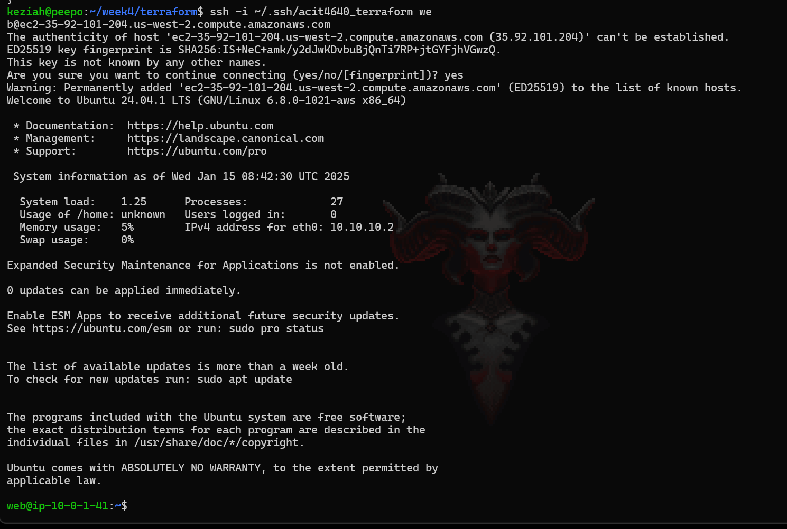
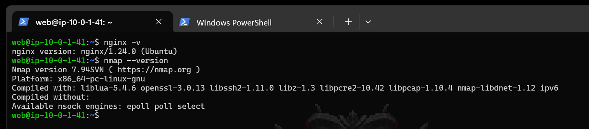

# lab-week4-terraform
---
Austin Park | Keziah Wacnang | Nai Yen Lin
 

### Task 1
---
Create new SSH keypair using the following command:
`ssh-keygen -t ed25519 -f acit4640_terraform -C "acit4640_terraform key"`

Adding the public key to the included cloud-init config file:
* edit the `cloud-config.yaml` file to add our public key

```yaml

#cloud-config
users:
  - name: web
    primary_group: web
    groups: wheel
    shell: /bin/bash
    sudo: ['ALL=(ALL) NOPASSWD:ALL']
    ssh-authorized-keys:
      - <public-key>

```

To get the ssh public key content:
* `cat ~/.ssh/acit4640_terraform.pub`
* we then copied it over to the `<public-key>` field in the `cloud-config.yaml` file

Then we added the packages we needed to install: `nginx` and `nmap`:
```yaml

users:
  - name: web
    primary_group: web
    groups: wheel
    shell: /bin/bash
    sudo: ['ALL=(ALL) NOPASSWD:ALL']
    ssh_authorized_keys:
      - <ssh-key-here>

package_update: true
package_upgrade: true
packages:
  - nginx
  - nmap
```
* this will update and upgrade the packages first before installing the following packages.

To check if the config file is validated:
* `cloud-init schema -c cloud-config.yaml --annotate`

Sources:
* https://cloudinit.readthedocs.io/en/latest/explanation/about-cloud-config.html
* https://cloudinit.readthedocs.io/en/latest/howto/debug_user_data.html#check-user-data-cloud-config

### Task 2
---
Now edit and complete the `main.tf`:

To enable dns:
* `enable_dns_hostnames = true` and `enable_dns_support = true`
    * as the default value is set to `false`

Then to add project name using local, refer to your `locals` block:
```tf

locals {
    project_name = "lab_week_4"
}

resource "aws_vpc" "web" {
  cidr_block           = "10.0.0.0/16"
  enable_dns_support = true
	enable_dns_hostnames = true

  tags = {
    Name    = local.project_name
  }
}
```

to add vpc:
* `vpc_id = aws_vpc.web.id`

to add gateway id:
* `gateway_id = aws_internet_gateway.web-gw.id`
* making sure to refer to the resource name correctly

to add subnet id:
* `subnet_id = aws_subnet.web.id`

to allow ssh from anywhere:
```tf
  # allow ssh anywhere
  cidr_ipv4   = "0.0.0.0/0"
  ip_protocol = "tcp"
  from_port   = 22
  to_port     = 22

```
* allow all from using `0.0.0.0/0` and only from port 22/ssh

Similarly to allow http from anywhere:
```tf
	# allow http anywhere
  cidr_ipv4   = "0.0.0.0/0"
  ip_protocol = "tcp"
  from_port   = 80
  to_port     = 80v
```

for the "aws_instance" resource:
```tf
resource "aws_instance" "web" {
	# use ami provided by data block above
  ami          = data.aws_ami.ubuntu.id
  # set instance type
  instance_type = "t2.micro"
	
  # add user datat for cloud-config file in scripts directory
  user_data = file("scripts/cloud-config.yaml")
  
  # add vpc security group
  vpc_security_group_ids = [aws_security_group.web.id] 
  subnet_id              = aws_subnet.web.id

  tags = {
    Name = local.project_name
		# add project name using local

  }
}
```
*  we utilized the cloud-config.yaml file using `user_data = file("scripts/cloud-config.yaml")`
*  we used file() since we want to specify which file our user data is coming from.
* we also added `vpc_security_group_ids = [aws_security_group.web.id]` to add our vpc security groups, and its important to use this version as we are using vpcs for our case.


Sources: 
* https://registry.terraform.io/providers/hashicorp/aws/latest/docs/resources/vpc
* https://registry.terraform.io/providers/hashicorp/aws/latest/docs/resources/route_table_association
* https://registry.terraform.io/providers/hashicorp/aws/latest/docs/resources/instance


### Task 3
---

